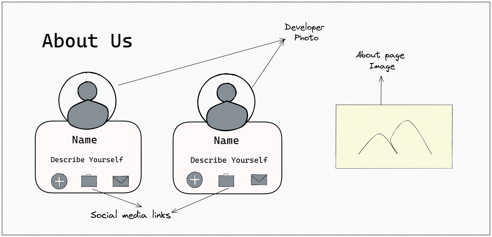
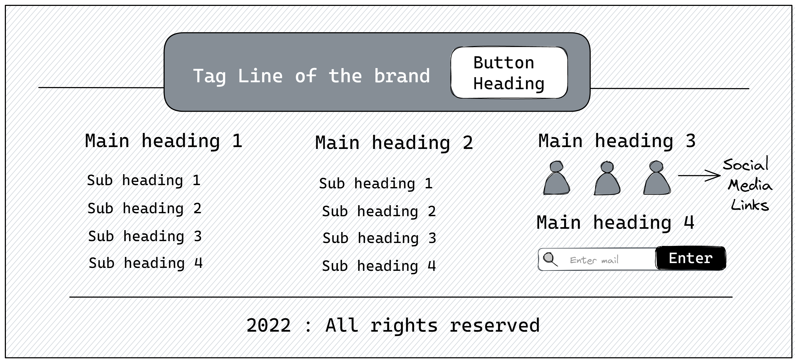

# Weather.io

Webiste build using [OpenWeather API](https://openweathermap.org/) for showing weather updates for particular city.

## Demo
The live link of the website is <a href = "https://showweather-website.netlify.app/" target = "_blank">here</a>

## Step 1: Design layout

  
   
  
   

